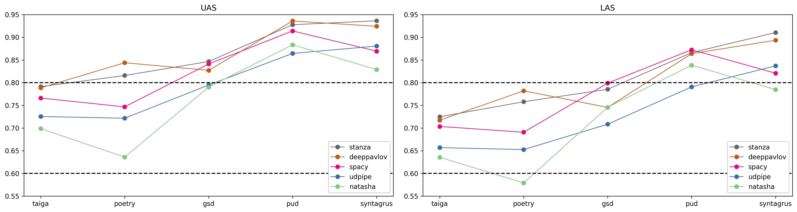
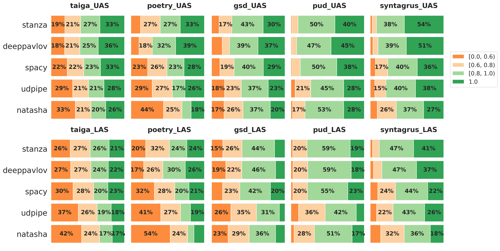
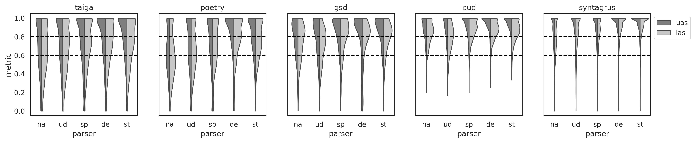
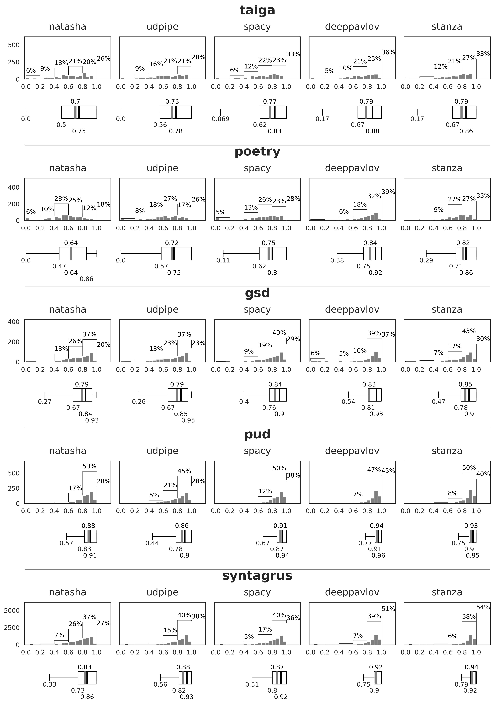
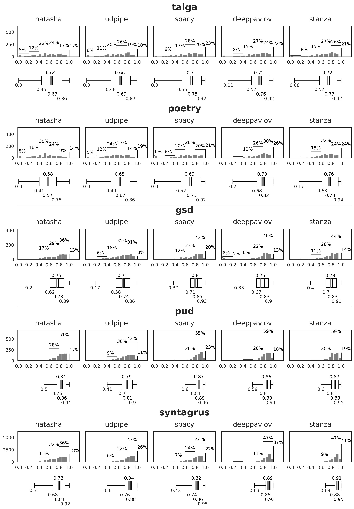
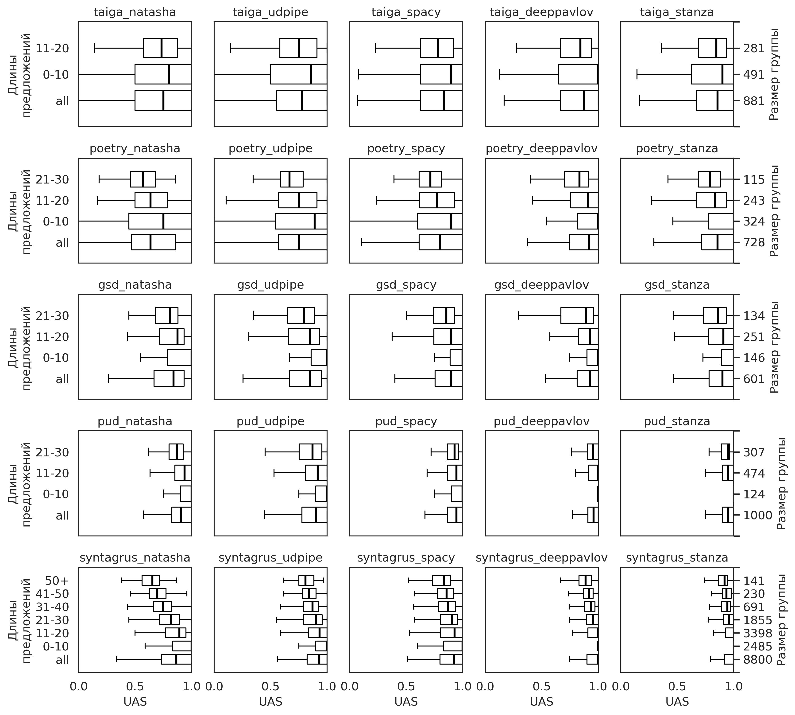
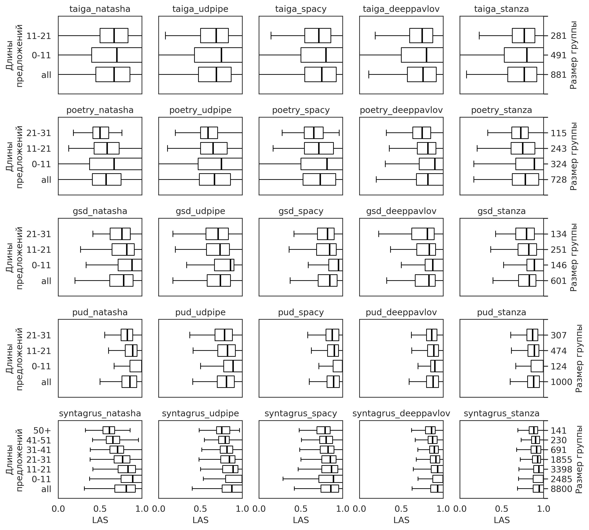
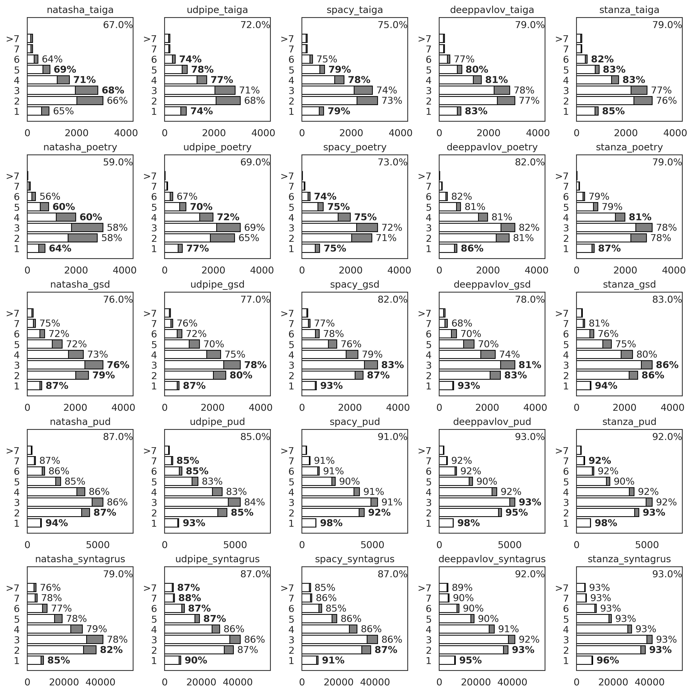
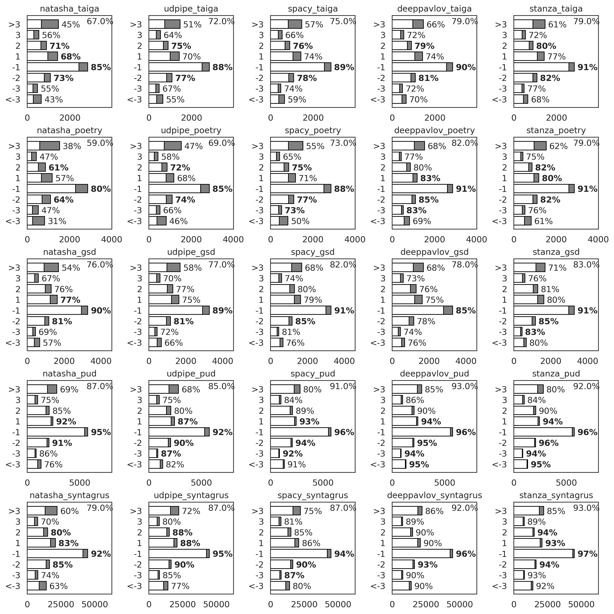

# Сравнение нейросетевых синтаксических анализаторов для русского языка

## Оценка на уровне предложений
### Средние значения метрик UAS и LAS

### Категориальная оценка распределений метрик UAS и LAS

### Сравнение распределений метрик UAS и LAS

### Распределение метрики UAS

### Распределение метрики LAS

### Распределение метрики UAS на предложениях разной длины

### Распределение метрики LAS на предложениях разной длины

## Оценка на уровне токенов
### Эталонная глубина токена

### Эталонная длина зависимости
Длина зависимости - разница между id токена и id соответствующего родительского токена.

